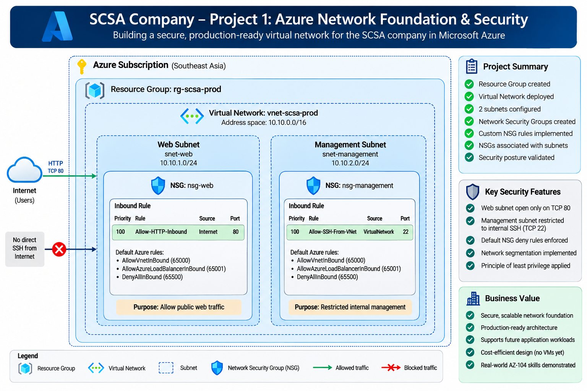

# SCSA Company – Project 1: Azure Network Foundation and Security

## Project Overview

This project demonstrates the design and implementation of a secure Azure network foundation for SCSA Company.

The environment is designed using Azure networking best practices, including network segmentation, Network Security Groups (NSGs), controlled inbound access, and separation of web and management workloads.

## Business Scenario

SCSA Company requires a secure and scalable Azure network foundation that can support future application workloads.

The initial design separates:

- Public-facing web workloads
- Internal management workloads

The objective is to establish a secure network baseline before deploying virtual machines and application services.

## Architecture Diagram

## Architecture

### Azure Region

- Southeast Asia

### Resource Group

- `rg-scsa-prod`

### Virtual Network

- Name: `vnet-scsa-prod`
- Address space: `10.10.0.0/16`

### Subnets

| Subnet | Address Space | Purpose |
|---|---|---|
| `snet-web` | `10.10.1.0/24` | Web workloads |
| `snet-management` | `10.10.2.0/24` | Internal management workloads |

## Network Security Groups

### Web NSG

`nsg-web`

Inbound HTTP traffic is permitted from the Internet:

| Rule | Direction | Source | Port | Access |
|---|---|---|---|---|
| Allow-HTTP-Inbound | Inbound | Internet | TCP 80 | Allow |

The default Azure NSG rules remain in place, including the default deny inbound rule.

### Management NSG

`nsg-management`

Management access is restricted to traffic originating from within the virtual network:

| Rule | Direction | Source | Port | Access |
|---|---|---|---|---|
| Allow-SSH-From-VNet | Inbound | VirtualNetwork | TCP 22 | Allow |

Direct SSH access from the public Internet is not permitted.

## Security Design

The network implements basic defense-in-depth principles:

- Network segmentation using separate subnets
- NSGs applied to individual subnets
- Public HTTP access permitted only through the web subnet's NSG
- Management SSH access restricted to the virtual network
- Default NSG deny rules retained
- Least-privilege network access

## Azure Resources

The following Azure resources were created:

- Resource Group
- Virtual Network
- Web Subnet
- Management Subnet
- Web Network Security Group
- Management Network Security Group

## Implementation

The Azure network foundation was deployed using Azure CLI scripts.

### Deployment Scripts

- [01-resource-group.sh](./scripts/01-resource-group.sh) – Creates the production resource group.
- [02-network.sh](./scripts/02-network.sh) – Creates the virtual network and application subnets.
- [03-nsg-rules.sh](./scripts/03-nsg-rules.sh) – Creates the Network Security Groups, configures inbound security rules, and associates the NSGs with their respective subnets.

The scripts provide a repeatable command-line deployment approach and document the implementation of the environment.

## Validation

Azure CLI was used to verify:

- Resource group deployment
- Virtual network configuration
- Subnet configuration
- NSG configuration
- NSG-to-subnet associations
- Security rules

The deployed configuration was validated against the intended network and security design.

## Implementation Evidence

Detailed implementation and validation screenshots are available in the [`screenshots`](./screenshots/) directory.

The evidence includes:

- Resource group creation
- Virtual network and subnet configuration
- Network validation
- Web NSG configuration
- Management NSG configuration
- NSG security rules
- NSG-to-subnet associations

## Skills Demonstrated

- Azure Virtual Networks
- Azure Subnets
- Network Security Groups
- Network segmentation
- Inbound traffic control
- Azure CLI
- Azure resource management
- Basic cloud security architecture
- Infrastructure documentation

## Project Status

**Completed**

The Azure network foundation has been deployed and validated.

The environment establishes the networking and security baseline required for subsequent compute, identity, and application infrastructure.
